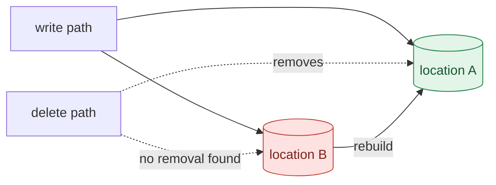

# Trace deletion

Answer one question with evidence: **if this record is deleted, where could it still exist?** Then repair what's missing and prove the repair.

Work in **Agent mode**: this workflow needs command execution, MCP tools, file edits and subagents. Create a todo list from the steps below and keep it updated as you go.

## Rules of evidence

- Documentation, comments, schema constraints and function names are **claims**. Reading code produces **suspected** findings. Only the inspector's observations **confirm** that data survived or was removed.
- Every statement in the report cites a `file:line` or an inspector run ID.
- Never call a location clean unless the inspector checked it. Anything unchecked is **not verified**.
- Run experiments only on synthetic records: an owner like `user-0NN` and a canary string `FG-CANARY-…` in the seed file. If the target isn't synthetic, stop and tell the user.
- Delete only through the application's own delete path. Never remove leftovers directly from a store; that hides the bug instead of fixing it.
- Never write to a store yourself, even to test a theory: no hand-written SQL, vector-store calls or file edits against live data. Observe with `inspect_record`, and change state only through `reset_fixture`, `run_deletion_experiment` and the app's own endpoints.
- Describe code exactly. If a setting is off because nothing turns it on, say that; don't write that the code sets it off.
- Don't edit the inspector, the seed data, the reset path or tests to make a result pass.

## Input

The target record ID, for example `doc-003`. The inspector looks up its canary and probe question in the seed file. If the user didn't name a record, ask once.

## Step 1 — Read the claims

Read `docs/architecture.md`, plus `AGENTS.md` and `README.md` if present. Build a **claimed inventory**: every location the docs say holds the record's data, what writes it, and what the docs say removes it on delete. Note any explicit deletion guarantee. Don't trust any of it yet.

## Step 2 — Trace the code with three parallel subagents

Spawn three `explore` subagents **in the same turn** so they run in parallel. Each trace reads many files and only a summary is needed back, which is what subagents are for. Subagents don't see this conversation by default, so pass each brief below in full, with the placeholders filled in: `{repo}` (workspace root), `{record}` (target ID) and `{doc}` (the architecture doc path).

**Brief A — relational stores**

> Read-only audit of the code in {repo}. Target: record {record}. Find every SQL table that stores content from a record or rows keyed to it. For each table report: what it stores; where it's written (file:line); the key linking rows to the record; every code path that removes those rows (file:line), or "none found"; the mechanism relied on (explicit DELETE, foreign-key cascade, trigger, ORM relationship, other); any condition that mechanism needs in order to actually run (connection settings, engine options, migrations, configuration) and whether the code meets it, with file:line. Also report any path that copies rows from these tables into another store (reindex, backfill, export, sync). Cite code, not comments or docs. Return only a markdown table with columns Table | Contents | Written at | Keyed by | Removed by | Mechanism | Precondition met? | Copied elsewhere by, then at most five short notes.

**Brief B — vector and search indexes**

> Read-only audit of the code in {repo}. Target: record {record}. Find every vector index, search index or embedding collection that holds content derived from a record. For each report: the index or collection name; where it's written (file:line); the exact IDs and metadata keys written; every code path that deletes from it (file:line); the exact IDs or filter used at delete time; whether those can match what was written, comparing key names and ID formats character by character; whether the delete result is checked (count or error). Also report any path that rebuilds or repopulates the index, and what it reads from. Cite code, not comments or docs. Return only a markdown table with columns Index | Written at | IDs and keys written | Deleted at | IDs or filter at delete | Can match? | Result checked? | Rebuilt from, then at most five short notes.

**Brief C — copies the documentation doesn't list**

> Read-only audit of the code in {repo}. Target: record {record}. The documented storage locations are in {doc}. Search for any other place a record's content, title or derived data is written or retained: log statements that include request bodies or record text; files written to disk, including temp files and exports; in-process caches (functools.lru_cache or cache, module-level dicts or lists, memoization); external caches; queues and background tasks; analytics or audit events; calls that send record content to outside services. Also check that each documented location actually exists in the code. For each finding report the location, what's retained, where it's written (file:line), whether it's cleared on delete (file:line or "no"), and whether {doc} lists it. Cite code, not comments or docs. Return only a markdown table with columns Location | What's retained | Written at | Cleared on delete? | In the doc?, then at most five short notes.

## Step 3 — Reconcile

Merge the three results with the claimed inventory into one **observed inventory**, and list every **suspected gap**, each with `file:line`:

- a location the docs don't mention;
- a location with no removal path;
- a removal whose IDs or filter can't match what was written;
- a removal that relies on a mechanism whose precondition isn't met;
- a location that can be copied back into a read path (reindex, backfill, restore) without being cleaned first.

## Step 4 — Run the deletion experiment

Call the MCP tool `run_deletion_experiment` with the record ID. It resets the fixture, inspects every reachable store, deletes the record through the app's API, and inspects again. Report the delete response and a before/after table per location. If the verdict is `invalid` (the record wasn't present before the delete, or the app couldn't be reached), fix the setup and rerun; never interpret an invalid run.

If the result contradicts the code trace (for example, step 3 found no working removal path but the verdict is `clean`), check first that the running app is serving the code on disk. Find the process listening on the app's port, and compare its start time with the modification times of the app's source files. If it started earlier and isn't auto-reloading, ask the user to restart it, and don't count runs against it as evidence. Don't restart it yourself.

If step 3 found a path that copies data back into a read path, trigger it once after the delete (for example with `curl` against its endpoint) and call `inspect_record` again. Data that reappears is a finding.

## Step 5 — Diagnose

For each location where data survived, and for a retrieval probe that still returns the record, give:

- the root cause at `file:line`;
- the failure mode from the list below;
- one or two sentences on why the delete missed it.

Mark suspected gaps from step 3 that the experiment didn't confirm as **not confirmed**, with the reason. If a residual has no identified cause, say so rather than guess; you may spawn one more `explore` subagent to chase it.

## Step 6 — Propose the repair

Write the smallest patch that makes the app's own delete path remove the data everywhere it survived. Wherever the stores allow it, the patch must:

- delete by the same IDs or keys the write path used;
- use explicit deletes rather than mechanisms that depend on runtime settings;
- remove derived copies before the source of truth, so a failure leaves the record visibly present and retryable rather than half-deleted;
- verify after each delete that nothing matching the record remains in that store, and return an error instead of success if something does.

Keep the API contract unchanged. Show the diff and explain each change in one sentence. Wait for the user's approval before applying it, unless they already told you to go ahead.

## Step 7 — Verify

Run `run_deletion_experiment` again. It passes only when the verdict is `clean`: the record was present before, the delete returned success, no location has a keyed or content match afterward, and the retrieval probe no longer returns it. If a copy-back path exists, trigger it again and confirm nothing reappears. If anything remains, go back to step 5. Stop after three repair rounds and report what's left.

## Step 8 — Report

Write `reports/deletion-trace-{record}.md` with:

1. **Verdict**, in one line.
2. **Deletion graph**: two Mermaid flowcharts, before and after the fix. Nodes are the write, delete, read and rebuild paths and each storage location; edges show writes, removals and copy-backs. Locations with residuals get the `leak` class and verified locations get `clean`. Follow this shape:

3. **Claimed vs observed inventory**, as one table.
4. **Evidence**: for each location, the result before the delete, after the delete without the fix, and after the delete with the fix, with run IDs.
5. **Findings**: for each, the failure mode, the cause (`file:line`), the fix and the evidence.
6. **Not verified**: the inspector's `not_checked` list, plus anything else you couldn't check.

End your chat reply with the verdict, the after-fix graph and the path to the report.

## Failure modes

1. **Key mismatch** — the delete uses different IDs, key names or ID formats than the write (a parent ID instead of child IDs, a renamed metadata field). Many stores treat a filter that matches nothing as a successful delete.
2. **Declared but not enforced** — cleanup is declared (cascade, trigger, TTL, event hook, ORM relationship), but a runtime precondition isn't met, so it never runs.
3. **Missing fan-out** — the delete path skips a location the write path touches.
4. **Silent success** — the delete reports success without checking what was removed, or swallows the error.
5. **Unlisted copies** — logs, caches, temp files, exports, queues or analytics events hold content outside the documented stores.
6. **Resurrection** — a location that isn't read at query time is copied back into one that is.
7. **Soft-delete leak** — a deleted flag that some read path ignores.
8. **Deferred deletion** — cleanup queued for later that can fail, lag or be dropped.

## Tools

The `forgetgraph` MCP server provides `reset_fixture`, `inspect_record` and `run_deletion_experiment`. Their contract, matching rules and output format are in `inspector-contract.md` in this folder.